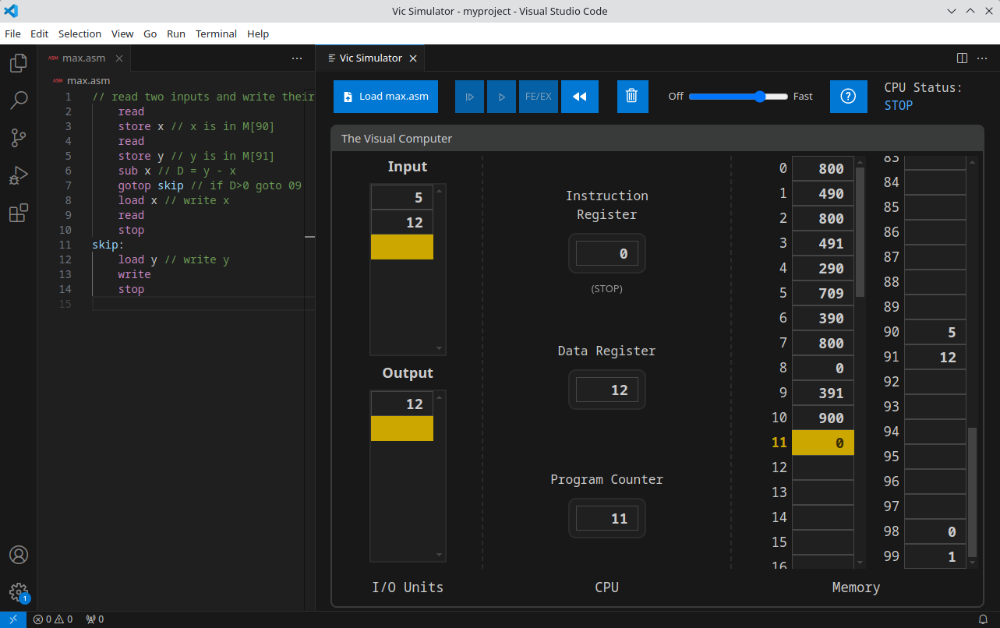

# vic-ide

Visual Computer (Vic)

Vic website: <https://shimonschocken.wixsite.com/visualcomputer>

## Web Demo

A demo is available that can be run directly in your web browser:
<https://vic-ide.github.io/vic-ide/>

## Visual Studio Code Extension

The main way to use Vic is to use the Visual Studio Code Extension:

<https://marketplace.visualstudio.com/items?itemName=vic-ide.vic-ide>

The simulator runs directly inside a panel in Visual Studio Code, and you can directly edit and load Vic source files.

## Getting Started

Please see the [Getting Started Guide](docs/getting-started.md)

## Development

### UI

The project uses the following minimalistic CSS reset:
<https://github.com/Andy-set-studio/modern-css-reset>

### Running Tests

To run the main unit tests run:

    $ npm run test

A coverage report will be generated in the directory `coverage`. You can open
the file `coverage/lcov-report/index.html` in your web browser to view the
report. Note that the generated report will overwrite an existing report from
the VS Code extension tests (below).

During development you can start a live test watcher for faster iteration time:

    $ npm run start-test

If you modify any file then the relevant tests will automatically be run.

Note that a coverage report will not be generated when the tests are run in this
mode.

#### VS Code Extension Tests

There is a separate test suite for the VS Code extension that checks proper UI
behaviour.

To run all the tests:

    $ npm run build-webview
    $ npm run test-ext

To run all the tests and generate code coverage:

    $ npm run build-webview
    $ npm run test-ext-coverage

A coverage report will be generated in the directory `coverage`. You can open
the file `coverage/lcov-report/index.html` in your web browser to view the
report. Note that the generated report will overwrite an existing report from
the main unit tests (above).

To run a single test:

    $ npm run build-webview
    $ npm run compile-ext
    $ NODE_OPTIONS=--experimental-vm-modules ./node_modules/.bin/jest --config={} --runInBand --runTestsByPath build-ext/src-ext/test/testRunner.test.js -t sim_set_cpu_registers.test.ts

Replace `sim_set_cpu_registers.test.ts` with the name of the test.

See also the jest documentation for the `-t` flag:
<https://jestjs.io/docs/cli#--testnamepatternregex>

Each test is a single file from the directory `src-ext/test/suite`.

Note that in the above commands you can skip the `npm run build-webview` or `npm
run compile-ext` step if you didn't change any of the relevant source files.

When running a single test, you can define the following environment vars:

`export SLOW_TESTS=1`: Slows down the tests, so that you can see them running
live. Useful for seeing what is happening during the test, to see where things
went wrong if the test fails.

`export COVERAGE=1`: Create a coverage report. This is most useful when running
the entire test suite, but can occasionally be helpful to see the coverage of a
single test (or several).
